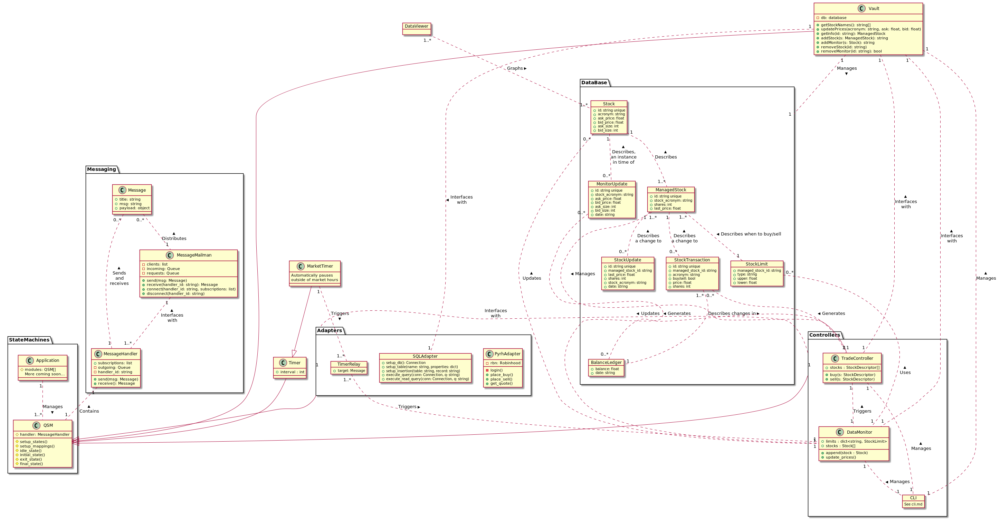

# Python Robinhood AutoTrader

## Description
This project contains code for collecting automating the trading of stocks via the [Robinhood](https://robinhood.com/) website

## Contents
1. [Installation](#Installation)
2. [Module Breakdown](#Module-Breakdown)

# [Installation](#Installation)
To use the software all you have to do is run `main.py`.

To configure the websites that it uses modify the list inside of `defs.py`

To define your own parsers, see the `WebsiteParser.py` file.

## [Configuration](#Configuration)

To use your account the program needs your login credentials, these credentials can be entered into [login.py](./login.py)

More coming soon

# [Module Breakdown](#Module-Breakdown)
The project architecture is broken down as follows [[source]](./architecture.puml):

