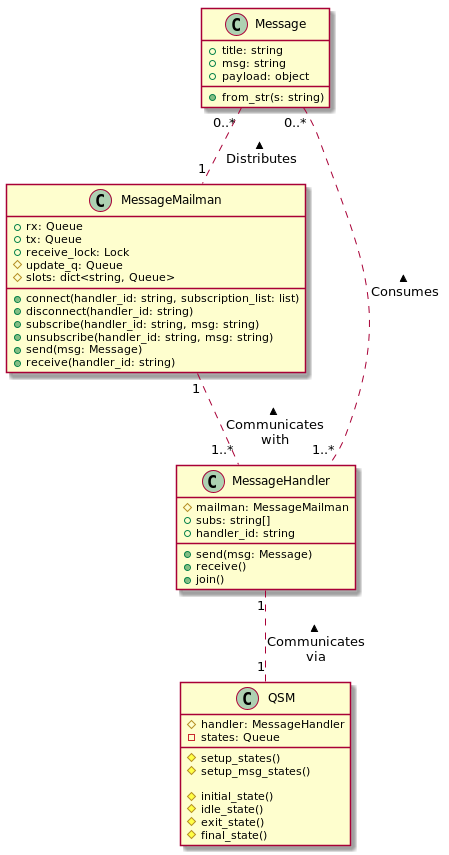

# tradebot.messaging

This directory contains the means for creating custom `queued state machines` or QSMs. These are `Process`s that
 communicate with each other via sending and receiving `Message`s.
 
 ## Usage
 
 To create custom QSMs, you need to define which messages you want to subscribe to in the constructor
 
 ```python
class Example(QSM):
    def __init__(self, name: str):
        super().__init__(name, ['timer'])
```

In this example, the given classes subscribes to the `'timer'` message title. This means that any message sent with the
 title `'timer'` will be received by this module. Determining where to go is assigned during a call to the `setup_states()` method.
 
```python
def setup_mappings(self):
    super().setup_mappings()
    self.mappings['connect'] self.connect_tcp
```

Means that when the state machine goes to the `'connect'` state, then the function `connect_tcp()` will be called.

By default states don't accept any arguments, but if you pass a single argument when calling `append_state()` or `append_states()` 
will cause the handler to pass that in as a single argument. By default when a `Message` is received, that message is also 
sent along to its corresponding method.

By default messages are setup to call `messagename_msg()` whenever a message is received. But you can change this in the method `setup_msg_mappings()`. 

### Basic Operation

